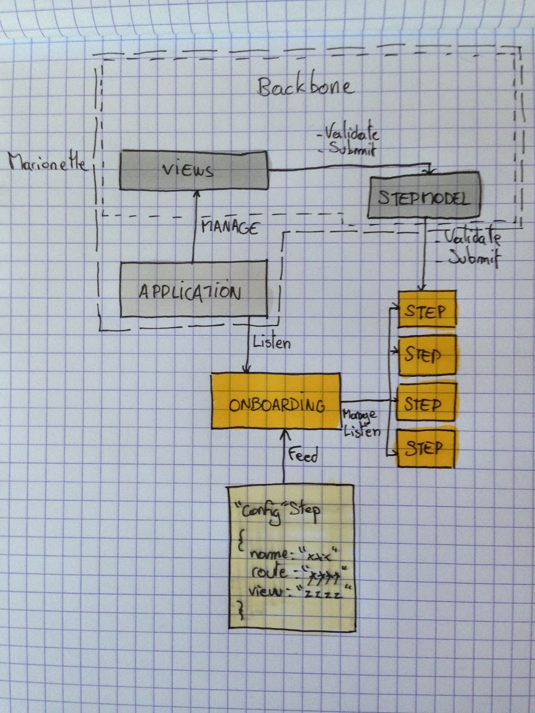

## Onboarding component

### Modelisation naive diagram


### Onboarding class

This class, located in `lib/onboarding`, is an agnostic and framework free onboarding manager. It manages the different steps of onboarding and handle event triggered by steps object.

This class has to facilitate migration to another framework in the future. At this time, the framework used is Backbone/Marionette and Onboarding is implemented like a classical POO object.

### Step object
Step objects are simple configurationJavaScript object declared in separated files. Their role is to describe each onboarding step, with properties, but also with methods when needed, as validation methods for example. They are located in `steps` directory.

#### Step class

The class represents an onboarding step, for example the greetings step or the password definition step.

It takes as parameter a simple JavaScript object described in previous paragraph.
It also ensures that each step will have defaults mandatory methods like `submit`.

Howerver, it will be possible to override class methods in config objects (not implemented yet).

## Methods
### Onboarding
#### initialize(user, steps, currentStepName)
#### parameters
* `user`: JS object representing user's properties
* `steps`: Array of JS object representing steps
* `currentStepName`: String reprensenting the current (or first) step in onboarding.

Set the user and the steps list for the current onboarding.
Called by the constructor method.
The steps list should look like :
```javascript
[{
    name: 'Step 1', // Name should be unique
    route: 'step1', // URL segment
    views: 'steps/step1' // path to the view, but maybe it is too much  framework-specific and we should compute the view's path.
},{
    name: 'Step 2',
    route: 'step2',
    views: 'steps/step2'
}]
```

#### onStepChanged(callback)
##### Parameters
* `callback`: function

Record the function callback as handler for every time the current onboarding step will change.

#### goToNext()
Select the next step on the list and trigger the related events.

#### goToStep(step)
##### Parameters
* `step`: Step

Go directly to the given step and trigger required events. Useful for go back in onboarding.

#### getStepByName(stepName)
##### Parameters
* `stepName`: String

Returns a step by its name.

#### getProgression(step)
#### Parameters
* `step`: Step

Returns a JS object representing the progression in onboarding for the given `step`. This object contains the following properties :
* `current` (int): The current index, from 1 to the number of steps in the onboarding. 0 means that the step is not in the onboarding steps list.
* `total` (int): Total number of steps in the onboarding.
* `labels` (Array): Used for accessibility in views. It an ordered list of all the step names. Should be used as keys for Transifex.

#### getNextStep(step)
##### Parameters
* `step`: Step

Returns the next Step in onboarding step list.

Returns null if the given step is the last one.

Throw error if step does not exist in onboarding step list or if step parameter is missing.

#### Example
```javascript
let user = retrieveUserInAWayOrAnother();
let step1Options = {name: 'example1'};
let step2Options = {name: 'example2'};

let onboarding = new Onboarding(user, [step1, step2]);

let step2 = onboarding.getStepByName('example2');
let progression = onboarding.getProgression(step);
```
progression will be
```javascript
{
    current: 2,
    total: 2,
    labels: ['example1', 'example2']
}
```

#### getCurrentStep()

Returns onboarding's current step.

### Step

#### constructor(options, user)
* `options`: JS Object containing step properties and specific methods
* `user`: JS Object containing user properties

#### fetchUser(user)
* `user`: JS Object

Map some given user properties to the step. By default, the method just map the `username` for every step.

This method may be overriden by specifying a `fetchUser` method in constructor parameter.

__This method is called in the constructor__.

##### Example
```javascript
let user = {
    username: 'Claude',
    email: 'claude@example.org'
};

let step = new Step({
    fetchUser: (user) => {
        @username = user.username
        @useremail = user.email
    }, user
});

console.log(step.username);
// > Claude
console.log(step.useremail);
// > claude@example.org
```

#### isActive(user)
* `user`: JS Object

Returns true if the step has to be active for the given `user`. Returns `true` by default.
This method can be overriden by specifying an `isActive` method in constructor parameter.

#### save(data)
* `data`: Data to send to the server

This method returns by default a resolved Promise. This method may be overriden in a step object config. To work, it just needs to return a Promise.

##### Example
```javascript
let step = new Step({
    isActive: (user) => {
        // This step will be active only for Claude
        return user.name === 'Claude'
    }
});

let result1 = step.isActive({name: Claude});
// result1 = true

let result2 = step.isActive({name: Claudia});
// result = false
```


#### onSubmitted(callback)
##### Parameters
* `callback`: function

Add the given callback to the list of handlers to call when a step is submitted.

#### submit()
Submit the step, i.e. try to register it as done. This method should be overriden in config steps to manage specific submits or validation, for steps with forms for example.
Also, maybe it should return a Promise to handle correctly remote synchronisation.
